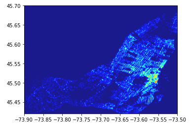
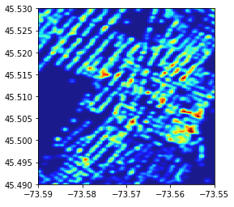
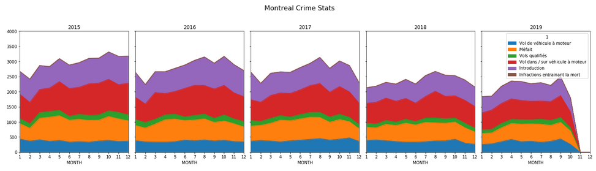
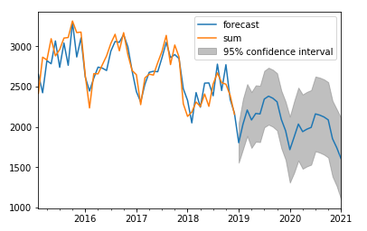

# Crime map of Monreal Island
* Visualized crime reported in Montreal and analyzed the crime trend.

### Data fetched form [OPEN DATA PORTAL(City of Montreal)](http://donnees.ville.montreal.qc.ca/dataset)

### 1. Visualize the crime reported on the Island of Montreal
* Overview of the island
  

  
* Downtown area
  

  
* Crime stats
  

  
### 2. Crime rate forecasting using ARIMA
  

